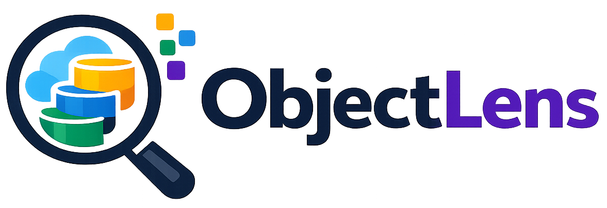

# ObjectLens

<p align="center">
  
</p>


ObjectLens is a Kubernetes-native object storage interface for fast access to Ceph RGW and S3-compatible object data.

ObjectLens is documented with MkDocs Material.

## Features

### Storage Providers
- **Ceph RGW & AWS S3**: High-performance object storage integration.
- **Garage**: Simple, lightweight provider optimized for local, air-gapped, or self-hosted environments.
- **Dynamic Discovery**: Automatic discovery and listing of buckets based on active credentials.

### Navigation & Search
- **S3-Style Pathing**: Native folder/prefix browsing.
- **Advanced Global Search**: Features an interactive 3-column workspace masonry grid overview, dynamic file-type color-coded extension badges, formatted file sizes, and `/` and `Escape` keyboard shortcuts.
- **Detailed Insights**: Paginated bucket browsing complete with indexed storage statistics.

### Previews & Actions
- **Rich File Previews**: Built-in viewing for text files, code (Python, Go, JS, etc), CSV, JSON, Parquet, and images.
- **Direct Operations**: Rename, move, delete single objects, or recursively clean up entire prefixes.
- **Safe Merges**: Merge prefixes with conflict protection to prevent overwrites.
- **Presigned Downloads**: Instantly generate shareable download links.

### Uploads & Batch Actions
- **Drag-and-Drop**: Easy uploading coupled with a dedicated verification/review queue and progress tracking.
- **Visual Card Wizards**: Symmetrical visual-card step wizards for selecting storage connections and bucket destinations smoothly.
- **Multi-Selection**: Multi-row selection to process operations on multiple items simultaneously.

### Operations & Audit Logs
- **DB-Backed Auditing**: Real, persistent SQLite `activity_log` tracking of bucket indexing, file uploads, file deletions, and prefix directory deletions.
- **Operations Timeline**: Beautiful paginated audit log timeline supporting default 50-event pages and relative, human-friendly date formatting.

### Security & Access Control
- **Declarative YAML Authentication**: Deploy role permissions by placing clean user manifests (e.g. `data/users/admin.yaml`) with passwords.
- **Granular RBAC Enforcements**: Separates `viewer` (read-only list, search, download, preview) and `admin` (write, upload, recursive delete, move, scan) privileges.
- **HTTP Basic Auth Integration**: Simple stateless S3 security configured dynamically on backend startup.

### Interface
- **Dynamic Theming**: Easily switch between light, dark, and system-matched theme modes.

## Quick Start

```bash
git clone <repo>
cd objectlens

devbox shell
cp example/.env.example .env
just install
just dev
```

Open:

```text
Frontend: http://localhost:3000
Backend Swagger: http://localhost:8000/docs
```

## Security & RBAC Configuration

To activate role-based access control, adjust these settings in your `.env` file:

```env
# Enable authentication: "none" (no login, default) or "local" (YAML manifests)
OBJECTLENS_AUTH_TYPE=local

# Folder storing YAML user manifests (defaults to backend/data/users)
OBJECTLENS_USERS_CONFIG_DIR=backend/data/users
```

On first startup with `OBJECTLENS_AUTH_TYPE=local`, ObjectLens automatically populates default account manifests in your config directory:
- **Admin:** `admin` / `adminpassword` (Full read/write privileges)
- **Viewer:** `viewer` / `viewerpassword` (Read-only browsing and downloading)

## Documentation

Run docs locally:

```bash
devbox shell
just docs
```

Open:

```text
http://localhost:8080
```

Build docs:

```bash
just docs-build
```

## Common Commands

```bash
just install
just backend
just frontend
just dev
just lint
just format
just test
just clean
```

Docker support remains available without Devbox:

```bash
docker compose up --build
```
