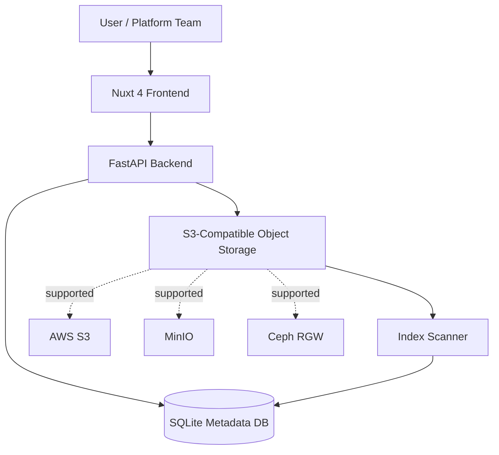
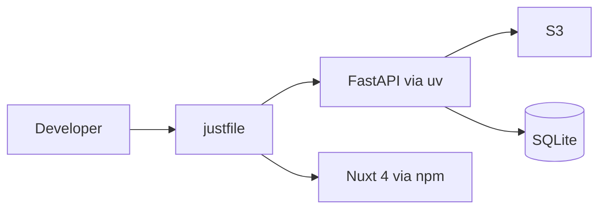

# ObjectLens

ObjectLens is a Kubernetes-ready object-storage browser for S3-compatible storage. It uses a Nuxt 4 frontend, a FastAPI backend, boto3 for object storage access, and a local SQLite metadata index for the PoC.

The goal is to make bucket browsing, metadata search, and presigned downloads easier than using AWS CLI or boto3 manually, while keeping the project straightforward to move into Kubernetes and GitOps later.

## Architecture





## Project Layout

```text
objectlens/
├── backend/
│   ├── app/
│   ├── pyproject.toml
│   ├── uv.lock
│   ├── Dockerfile
│   └── README.md
├── frontend/
│   ├── app/
│   ├── components/
│   ├── pages/
│   ├── nuxt.config.ts
│   ├── package.json
│   ├── Dockerfile
│   └── README.md
├── deploy/
│   └── kubernetes/
├── docker-compose.yaml
├── justfile
└── README.md
```

## Local Setup

Install dependencies and run both services:

```bash
just install
just dev
```

Services:

| Service | URL |
| --- | --- |
| Nuxt frontend | `http://localhost:3000` |
| FastAPI backend | `http://localhost:8000` |
| API docs | `http://localhost:8000/docs` |

## Backend Commands

```bash
cd backend
uv sync
uv run uvicorn app.main:app --reload --host 0.0.0.0 --port 8000
uv run ruff check .
uv run ruff format .
uv run pytest
```

## Frontend Commands

```bash
cd frontend
npm install
npm run dev
npm run build
```

Use this for local API configuration:

```bash
NUXT_PUBLIC_API_BASE_URL=http://localhost:8000
```

## Docker Compose

The compose stack runs the backend, Nuxt frontend, MinIO, and a demo bucket bootstrap job.

```bash
just docker-up
```

Or directly:

```bash
docker compose up --build
```

Ports:

| Service | URL |
| --- | --- |
| ObjectLens UI | `http://localhost:3000` |
| FastAPI backend | `http://localhost:8000` |
| MinIO API | `http://localhost:9000` |
| MinIO console | `http://localhost:9001` |

MinIO credentials are `minioadmin` / `minioadmin`.

Stop the stack:

```bash
just docker-down
```

## Kubernetes

Build and push images to your registry, then update:

```text
deploy/kubernetes/backend-deployment.yaml
deploy/kubernetes/frontend-deployment.yaml
```

Create a real secret from `deploy/kubernetes/secret-example.yaml`, then apply:

```bash
just k8s-apply
```

Delete:

```bash
just k8s-delete
```

The PoC Kubernetes manifest uses `emptyDir` for SQLite metadata. Replace it with persistent storage or Postgres before any shared environment.

## Environment Variables

Backend settings use the `OBJECTLENS_` prefix.

| Variable | Default | Description |
| --- | --- | --- |
| `OBJECTLENS_S3_ENDPOINT_URL` | unset | Optional S3-compatible endpoint. Leave unset for AWS S3. |
| `OBJECTLENS_S3_REGION` | `us-east-1` | S3 region. |
| `OBJECTLENS_S3_ACCESS_KEY_ID` | unset | Access key. If unset, boto3 uses its normal credential chain. |
| `OBJECTLENS_S3_SECRET_ACCESS_KEY` | unset | Secret key. If unset, boto3 uses its normal credential chain. |
| `OBJECTLENS_S3_BUCKET` | unset | Optional fixed bucket. If set, `/buckets` returns only this bucket. |
| `OBJECTLENS_S3_FORCE_PATH_STYLE` | `true` | Use path-style S3 addressing for MinIO/Ceph compatibility. |
| `OBJECTLENS_DATABASE_URL` | `sqlite:///./objectlens.db` | SQLite database URL for indexed metadata. |
| `OBJECTLENS_CORS_ORIGINS` | `["http://localhost:3000"]` | Allowed frontend origins. |

Frontend:

| Variable | Default | Description |
| --- | --- | --- |
| `NUXT_PUBLIC_API_BASE_URL` | `http://localhost:8000` | Base URL for the FastAPI backend. |

## API Overview

| Method | Endpoint | Description |
| --- | --- | --- |
| `GET` | `/health` | Service health. |
| `GET` | `/buckets` | List configured bucket or buckets visible to the credentials. |
| `GET` | `/objects?bucket=&prefix=&search=&limit=` | Search indexed SQLite metadata. |
| `POST` | `/index/scan?bucket=` | Synchronously scan S3 with `list_objects_v2` pagination and upsert metadata. |
| `GET` | `/objects/presign-download?bucket=&key=` | Create a one-hour presigned download URL. |

## PoC Limitations

- No auth yet.
- No RBAC yet.
- Synchronous indexing.
- SQLite only.
- No OpenSearch yet.

## Roadmap

- OIDC login.
- Bucket/prefix RBAC.
- Postgres metadata store.
- Background indexing worker.
- OpenSearch for large-scale search.
- S3 event-based indexing.
- File preview for JSON, CSV, Parquet, images.
- Audit log.
- Helm chart.
- Flux GitOps deployment.
