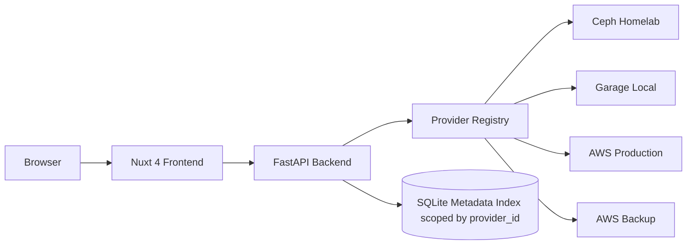
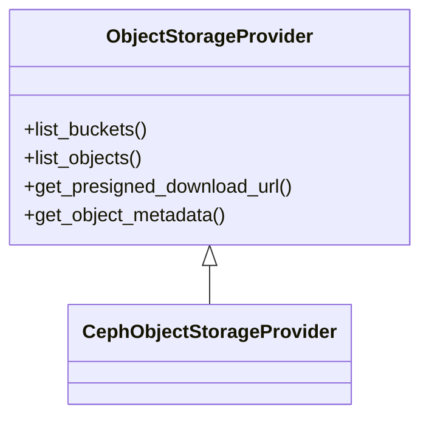
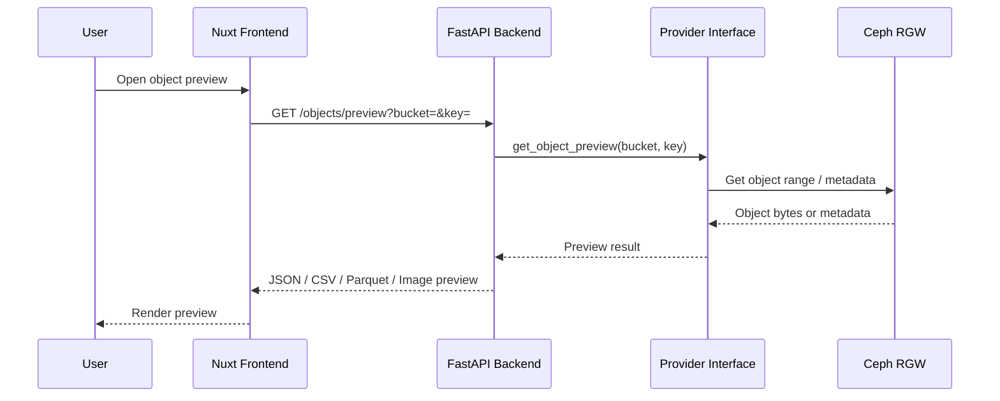
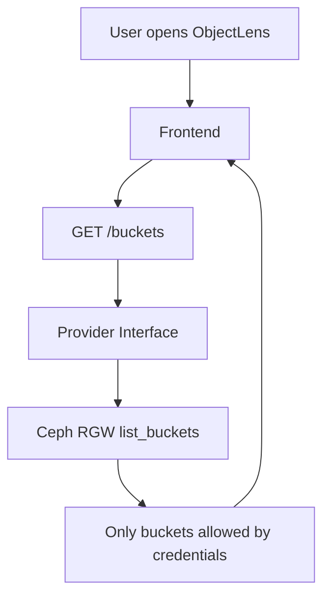
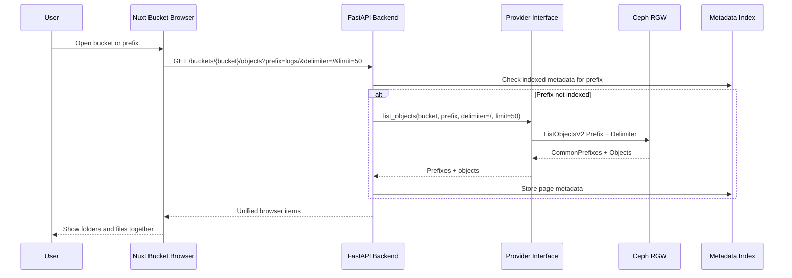
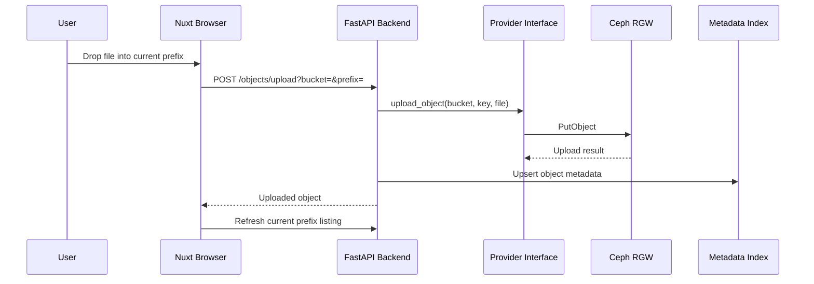
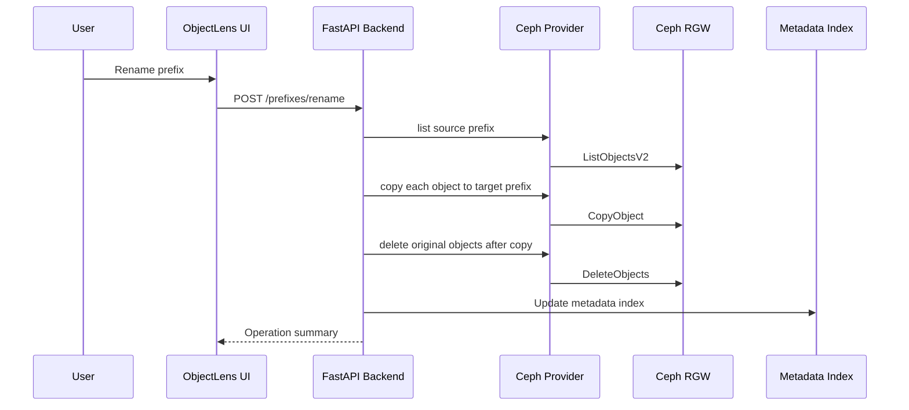
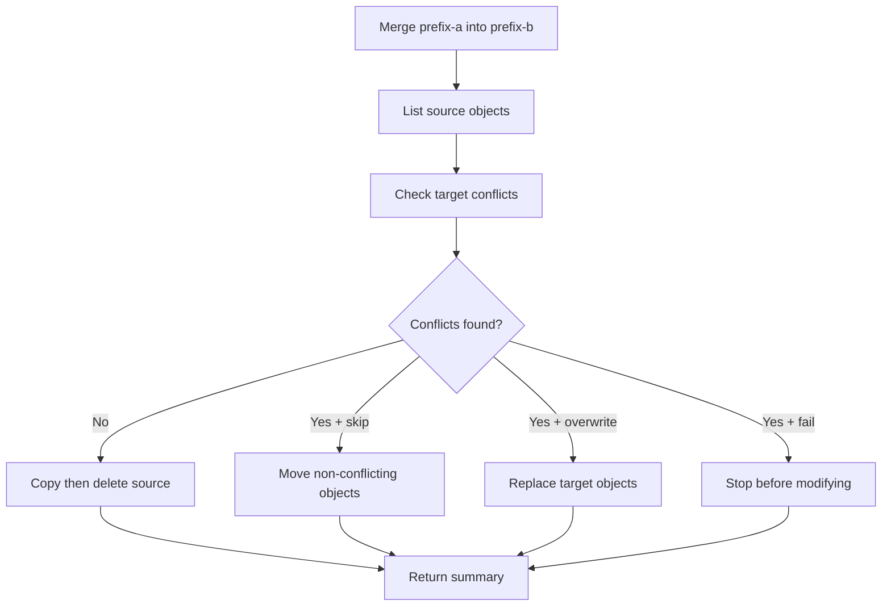
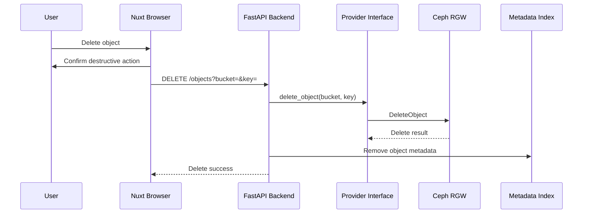
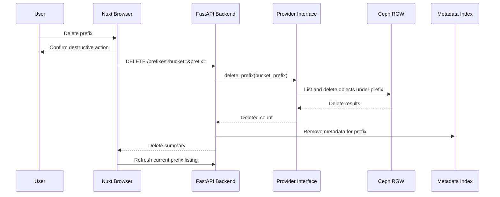

# Architecture

ObjectLens is split into a Nuxt frontend, FastAPI backend, provider abstraction, provider implementations, and a metadata index.



## Frontend

The frontend is a Nuxt 4 application under `frontend/app`. It renders the ObjectLens dashboard, reads the public API base URL from runtime config, and uses provider-neutral language while showing the active provider as Ceph RGW.

## Backend API

The FastAPI backend exposes stable endpoints:

- `GET /health`
- `GET /provider`
- `GET /buckets`
- `GET /objects`
- `POST /index/scan`
- `GET /objects/presign-download`

Routes depend on the provider interface rather than boto3 directly.

## Provider Abstraction

The provider layer lives in `backend/app/providers`. It defines shared types, an abstract provider interface, a Ceph provider, and a factory.



## Ceph Provider

The first provider is `CephObjectStorageProvider`. It uses boto3 against a Ceph RGW S3-compatible endpoint with path-style addressing.

`GarageObjectStorageProvider` supports Garage through the same S3-compatible boto3 behavior. Garage is useful for local development, air-gapped labs, and small self-hosted environments where running Ceph is unnecessary.

## Metadata Index

SQLite stores indexed object metadata for the PoC. Rows include the provider name, bucket, key, size, etag, last modified time, storage class, content type, provider metadata, and indexed timestamp.

Future deployments should move this to Postgres for shared use.

## Index Scanner

The scan endpoint pages through provider objects and upserts metadata into SQLite. The current scanner is synchronous. A later phase should move scanning into background workers.

## Future Search and Deployment

OpenSearch can take over full-text and large-scale object search. Kubernetes manifests exist today, and the project is shaped to move toward Helm and Flux without source code changes.

## Preview Flow



## Bucket Visibility



## Bucket Browsing And Pagination

ObjectLens does not load an entire bucket into the UI. Bucket content is shown in pages, and the default page size is 50 objects. The bucket browser treats prefixes as folder-like navigation, similar to the AWS S3 console. Nested objects only appear when the user enters the prefix.

In browse mode, `GET /buckets/{bucket}/objects` returns common prefixes and direct objects for the current prefix. In search mode, matching objects and prefixes are scoped to the current path and still paginated.

```mermaid
flowchart TD
  User[User opens bucket] --> UI[Bucket Page]
  UI --> API[GET /buckets/{bucket}/objects?prefix=&delimiter=/&limit=50]
  API --> DB[(Metadata Index)]
  DB --> Prefixes[Common Prefixes / Folders]
  DB --> Objects[Direct Objects Only]
  Prefixes --> UI
  Objects --> UI
  UI --> User
```

## Lazy Prefix Indexing

ObjectLens does not need to scan the full bucket before browsing. When a bucket or prefix is opened, ObjectLens asks the provider for only the current prefix page with `Prefix`, `Delimiter=/`, and the requested page size. Direct objects are stored in the metadata index, and discovered common prefixes are stored as folder-like browser entries. This keeps large buckets responsive while still allowing manual deeper scans when needed.



## Upload Flow

Uploads use a dedicated `/buckets/{bucket}/upload` page. The browser upload icon and drag-and-drop both route to this page, carrying selected files in frontend state where possible. Uploads do not start until the user reviews the target keys and clicks start.

Uploads are sent through the backend so the provider abstraction remains the only code path that talks to object storage. After a successful upload, ObjectLens updates the local metadata index and refreshes the current browser prefix.



## Multi-Select Operations

The bucket browser supports selecting visible rows with checkboxes. The bulk action bar validates actions based on selection:

- Download applies to selected objects only.
- Delete applies to objects and prefixes.
- Rename requires exactly one selected item.
- Move accepts one or more selected objects or prefixes.
- Merge accepts prefixes only.

Disabled actions stay visible with explanatory tooltips so users can understand what selection shape is required.

## Rename Object And Prefix

Object storage has no native rename. ObjectLens implements rename as copy then delete. The source is deleted only after the target copy succeeds, and the metadata index is updated after the provider operation.

Prefix rename recursively moves every object under the source prefix to the target prefix. The PoC executes this synchronously, but every operation receives an operation id and writes progress to the in-memory registry.



## Move Object And Prefix

Move uses the same copy-then-delete behavior. Objects move into the target prefix preserving their filename. Prefixes move into the target prefix preserving nested paths under the moved prefix name.

Before modifying data, ObjectLens checks for target conflicts when overwrite is disabled. Conflict responses are returned to the UI so the user can choose a safer target or explicitly allow overwrite.

## Merge Prefixes

Merge moves all objects from a source prefix into a target prefix while preserving relative paths. Conflict strategy is explicit:

- `fail` stops before modifying anything if duplicate targets exist.
- `skip` moves non-conflicting objects and leaves skipped source objects in place.
- `overwrite` replaces duplicate target objects.



## Operation Progress

Prefix rename, move, and merge create an `OperationStatus` record. The PoC stores these records in memory and returns completed summaries synchronously. The frontend progress modal is structured so it can poll `GET /operations/{operation_id}` when these jobs move to background workers later.

## Delete Object Flow

Single-object deletes remove the object through the active provider and then remove the matching row from the SQLite metadata index.



## Delete Prefix Flow

Prefix deletes are recursive and intentionally blocked for the bucket root. The provider lists objects under the prefix, deletes them in batches where supported, and ObjectLens removes indexed metadata for the deleted prefix.



## Scoped Search

Bucket search is scoped to the current browser path. At the bucket root, ObjectLens searches root-level visible names and immediate prefixes. Inside a prefix, ObjectLens searches names visible under that prefix. Glob-style patterns use `*` as a wildcard, so searches such as `*-billing-*`, `invoice-*.json`, and `*.parquet` work without scanning the whole bucket into the UI.
