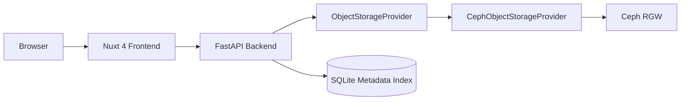
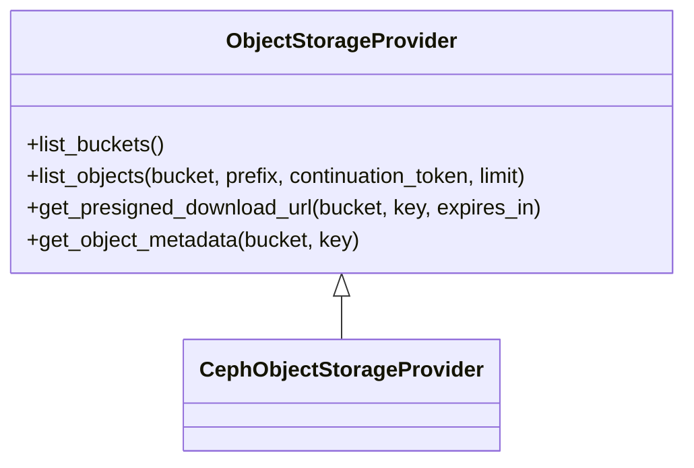
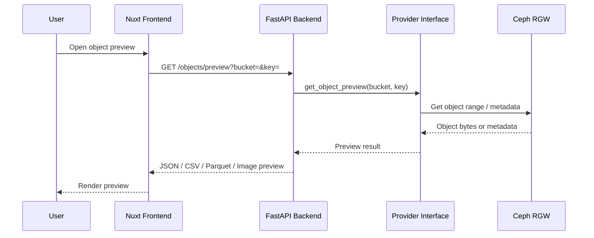
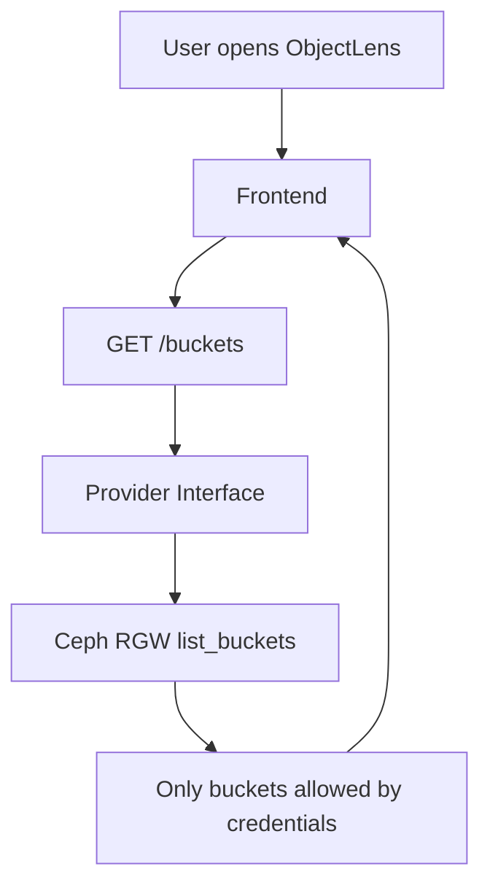

# Architecture

ObjectLens is split into a Nuxt frontend, FastAPI backend, provider abstraction, provider implementations, and a metadata index.

## Frontend

The frontend is a Nuxt 4 application under `frontend/app`. It renders the ObjectLens dashboard, reads the public API base URL from runtime config, and uses provider-neutral language while showing the active provider as Ceph RGW.

## Backend API

The FastAPI backend exposes stable endpoints:

- `GET /health`
- `GET /provider`
- `GET /buckets`
- `GET /objects`
- `POST /index/scan`
- `GET /objects/presign-download`

Routes depend on the provider interface rather than boto3 directly.

## Provider Abstraction

The provider layer lives in `backend/app/providers`. It defines shared types, an abstract provider interface, a Ceph provider, and a factory.

## Ceph Provider

The first provider is `CephObjectStorageProvider`. It uses boto3 against a Ceph RGW S3-compatible endpoint with path-style addressing.

## Metadata Index

SQLite stores indexed object metadata for the PoC. Rows include the provider name, bucket, key, size, etag, last modified time, storage class, content type, provider metadata, and indexed timestamp.

Future deployments should move this to Postgres for shared use.

## Index Scanner

The scan endpoint pages through provider objects and upserts metadata into SQLite. The current scanner is synchronous. A later phase should move scanning into background workers.

## Future Search and Deployment

OpenSearch can take over full-text and large-scale object search. Kubernetes manifests exist today, and the project is shaped to move toward Helm and Flux without source code changes.

## Preview Flow

## Bucket Visibility

