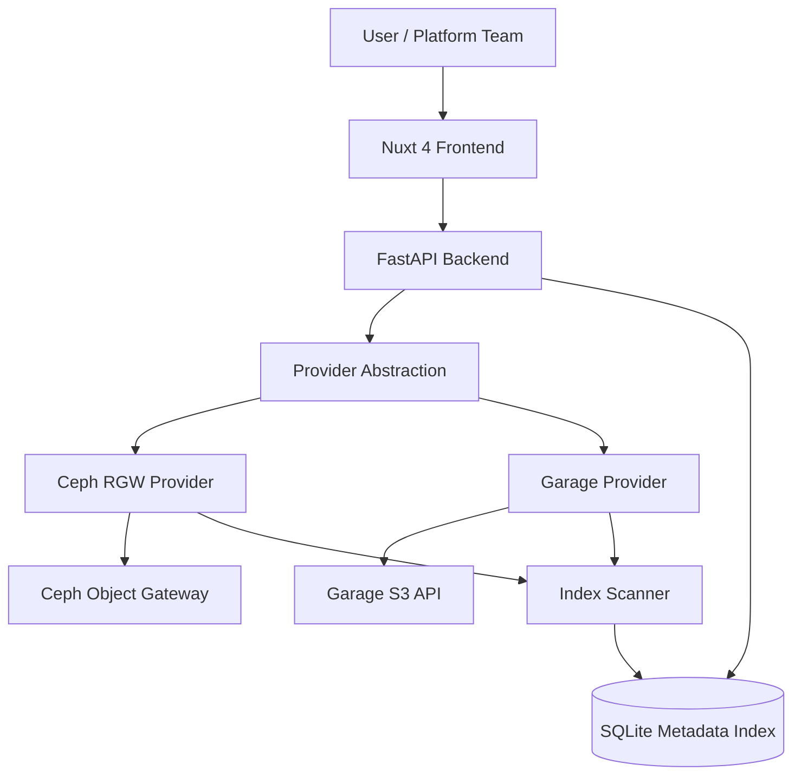

# ObjectLens

ObjectLens is a Kubernetes-native object storage interface for fast access to object data in Ceph RGW and other S3-compatible systems.

It exists because direct object storage tooling is powerful but slow for day-to-day exploration. AWS CLI and boto3 work, but they do not make it easy to quickly find, browse, index, and download objects from a homelab Ceph cluster.

The first real target is a homelab Ceph cluster exposed through Ceph Object Gateway. ObjectLens also supports Garage for local development, air-gapped labs, and small self-hosted environments. ObjectLens starts as a proof of concept, but the backend is structured around a provider abstraction so more storage systems can be added later without changing the API or frontend model.

The current PoC includes auth-aware bucket listing, bucket details, indexed search, presigned downloads, uploads, safer bulk operations, and limited previews for JSON, CSV, Parquet, and images. Bucket visibility comes from the configured provider credentials.

## Current Scope

- Nuxt 4 dashboard for provider status, buckets, search, scans, and object downloads.
- FastAPI backend with provider-neutral endpoints.
- Ceph RGW and Garage providers using the S3-compatible API through boto3.
- SQLite metadata index for the PoC.
- Manual bucket scan to populate searchable metadata.
- Safe object previews that read only a limited amount of object data.

## Design Direction

ObjectLens is intended to grow into a platform tool for object data access in Kubernetes. The PoC keeps infrastructure simple, but the source code is shaped for future Postgres, OpenSearch, background workers, OIDC, RBAC, Helm, and Flux.
