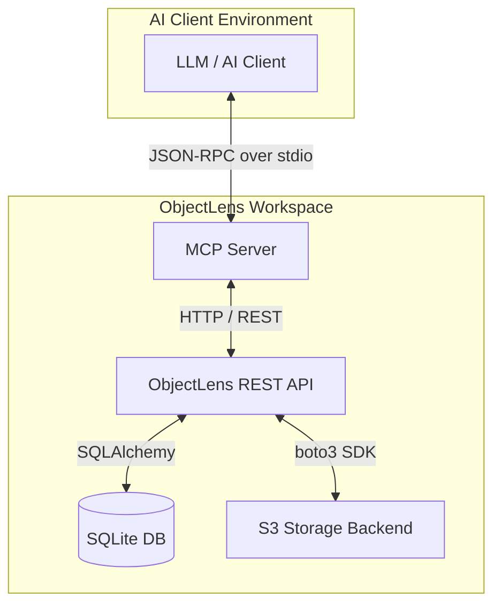
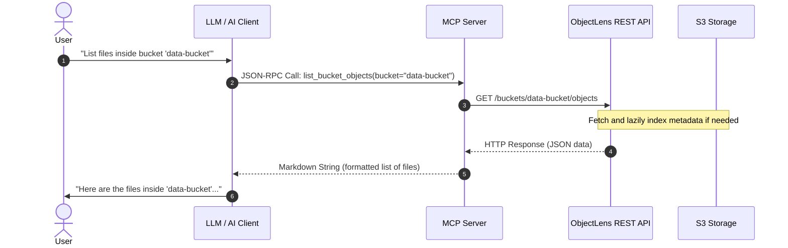

# MCP Server Architecture

The ObjectLens Model Context Protocol (MCP) server is a lightweight Python process that operates alongside the main ObjectLens REST API. It translates standard JSON-RPC tool calls from an AI assistant into REST API requests.

---

## System Components

- **AI Client (e.g., Claude Desktop, Cursor)**: The user interface where you prompt the LLM. The client spawns the MCP Server as a background subprocess and communicates with it using the Model Context Protocol over standard input/output (stdio).
- **MCP Server (Python)**: Acts as the protocol bridge. It reads JSON-RPC requests from standard input, maps them to standard HTTP requests, queries the ObjectLens REST API, and returns formatted markdown strings to standard output.
- **ObjectLens REST API**: The core service engine. It handles bucket browsing, metadata indexing, object operations, database interactions, and authentication.
- **SQLite Database**: Stores indexed object metadata and operations logs. This enables instant searches without hitting S3 directly.
- **S3 Storage (e.g., Ceph RGW, AWS S3, Garage)**: The physical object storage backend.

---

## Communication Flow

All tool executions follow a synchronous request-response flow initiated by the model:

---

## Transport and Concurrency

- **STDIO Transport**: The MCP server uses the standard `stdio` transport. It reads incoming JSON-RPC frames from `stdin` and writes responses to `stdout`. 
- **Stderr Logging**: Because `stdout` is strictly reserved for JSON-RPC frames, the server redirects all standard logging and errors to `stderr`. This prevents the JSON-RPC stream from becoming corrupted.
- **Asynchronous Execution**: The server is built on top of `httpx.AsyncClient` and python's `asyncio` framework. This allows it to handle concurrent API requests efficiently without blocking.

---

## Security and Credentials

- **Network Isolation**: The MCP server is meant to run locally on the client's machine or inside the same network perimeter as the ObjectLens API.
- **Authentication**: If the ObjectLens API is protected with HTTP Basic Authentication, the MCP server can be configured to use authentication credentials via environment variables (`OBJECTLENS_USERNAME` and `OBJECTLENS_PASSWORD`).
- **Authorization Enforcement**: Every API call initiated by the MCP Server is subject to the standard role-based access control (RBAC) rules enforced by the ObjectLens backend. If the configured user does not have permission to execute an action (e.g. scanning a bucket), the API returns a `403 Forbidden` error, which the MCP server formats and returns to the LLM.
