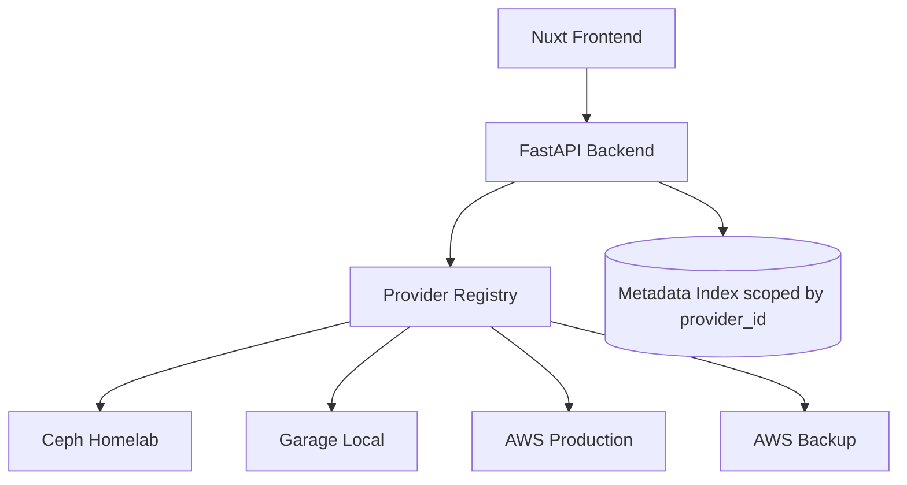

# Multi-Provider Connections

ObjectLens can connect to multiple object-storage systems at the same time. Each connection has a stable provider ID, a human-readable name, a provider type, endpoint information, region, credentials, and an optional default bucket.

This is useful when the same ObjectLens instance needs to browse separate environments:

- Ceph Homelab
- Garage Local
- AWS Production
- AWS Backup

## Configuration

Copy the example config and edit it locally:

```bash
cp .objectlens.providers.example.yaml .objectlens.providers.yaml
```

Example:

```yaml
providers:
  - id: ceph-homelab
    name: Ceph Homelab
    type: ceph
    endpoint_url: http://ceph-rgw.local:7480
    region: us-east-1
    access_key_id: xxx
    secret_access_key: xxx
    verify_ssl: false

  - id: garage-local
    name: Garage Local
    type: garage
    endpoint_url: http://localhost:3900
    region: garage
    access_key_id: xxx
    secret_access_key: xxx
    verify_ssl: false

  - id: aws-prod
    name: AWS Production
    type: aws
    region: eu-west-1
    access_key_id: xxx
    secret_access_key: xxx
    verify_ssl: true
```

Provider IDs are used in URLs and API paths, so keep them stable. Names are shown in the UI and can be changed later.

## API Shape

Provider-scoped endpoints include the provider ID:

```text
GET /providers
GET /providers/{provider_id}/buckets
GET /providers/{provider_id}/buckets/{bucket}/objects
POST /providers/{provider_id}/objects/upload?bucket=&prefix=
```

`GET /providers` returns public connection details only. Secrets are never exposed.

## Metadata Scope

ObjectLens scopes indexed metadata by provider connection ID. This prevents collisions when two providers have the same bucket and object key names.



## Security Notes

Do not commit `.objectlens.providers.yaml`. Keep real access keys in local secrets management, Kubernetes secrets, or another private configuration source. The checked-in `.objectlens.providers.example.yaml` intentionally uses placeholder credentials.
