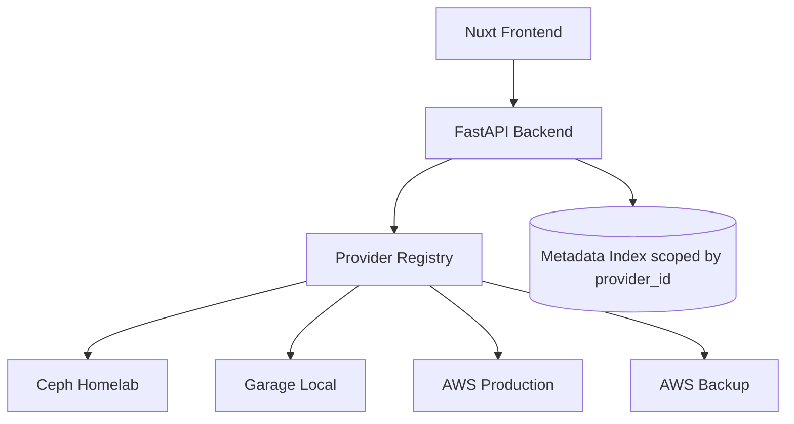

# Multi-Provider Connections

ObjectLens can connect to multiple object-storage systems at the same time. Each connection has a stable provider ID, a human-readable name, a provider type, endpoint information, region, credentials, and an optional default bucket.

A provider type is the implementation, such as `aws`, `ceph`, or `garage`. A provider connection is one configured target using that implementation. You can have many connections with the same type, such as AWS Production, AWS Backup, and AWS Sandbox.

This is useful when the same ObjectLens instance needs to browse separate environments:

- Ceph Homelab
- Garage Local
- AWS Production
- AWS Backup
- AWS Sandbox
- Ceph Lab

## Configuration

Copy the example config and edit it locally:

```bash
cp .objectlens.providers.example.yaml .objectlens.providers.yaml
```

Example:

```yaml
providers:
  - id: ceph-homelab
    name: Ceph Homelab
    type: ceph
    description: Homelab Ceph RGW cluster
    endpoint_url: http://ceph-rgw.local:7480
    region: us-east-1
    access_key_id: ${CEPH_HOMELAB_ACCESS_KEY_ID}
    secret_access_key: ${CEPH_HOMELAB_SECRET_ACCESS_KEY}
    verify_ssl: false
    tags: [homelab, ceph]

  - id: ceph-lab
    name: Ceph Lab
    type: ceph
    description: Lab Ceph RGW cluster
    endpoint_url: http://ceph-lab-rgw.local:7480
    region: us-east-1
    access_key_id: ${CEPH_LAB_ACCESS_KEY_ID}
    secret_access_key: ${CEPH_LAB_SECRET_ACCESS_KEY}
    verify_ssl: false
    tags: [lab, ceph]

  - id: aws-prod
    name: AWS Production
    type: aws
    description: Production AWS account
    region: eu-west-1
    access_key_id: ${AWS_PROD_ACCESS_KEY_ID}
    secret_access_key: ${AWS_PROD_SECRET_ACCESS_KEY}
    verify_ssl: true
    tags: [production, aws]

  - id: aws-backup
    name: AWS Backup
    type: aws
    description: Backup AWS account
    region: eu-west-1
    access_key_id: ${AWS_BACKUP_ACCESS_KEY_ID}
    secret_access_key: ${AWS_BACKUP_SECRET_ACCESS_KEY}
    verify_ssl: true
    tags: [backup, aws]

  - id: garage-local
    name: Garage Local
    type: garage
    description: Local Garage provider for dev and air-gapped testing
    endpoint_url: http://localhost:3900
    region: garage
    access_key_id: ${GARAGE_LOCAL_ACCESS_KEY_ID}
    secret_access_key: ${GARAGE_LOCAL_SECRET_ACCESS_KEY}
    verify_ssl: false
    tags: [local, dev]
```

Provider IDs are used in URLs and API paths, so keep them stable and unique. Names are shown in the UI and can be changed later.

Environment placeholders use `${ENV_VAR}` syntax. If a referenced variable is missing, ObjectLens fails startup with a clear error.

## API Shape

Provider-scoped endpoints include the provider ID:

```text
GET /providers
GET /providers/{provider_id}/buckets
GET /providers/{provider_id}/buckets/{bucket}/objects
POST /providers/{provider_id}/objects/upload?bucket=&prefix=
```

`GET /providers` returns public connection details only. Secrets are never exposed.

## Metadata Scope

ObjectLens scopes indexed metadata by provider connection ID. This prevents collisions when two providers have the same bucket and object key names.



## Security Notes

Do not commit `.objectlens.providers.yaml`. Keep real access keys in local secrets management, Kubernetes secrets, or another private configuration source. The checked-in `.objectlens.providers.example.yaml` intentionally uses placeholder credentials.
